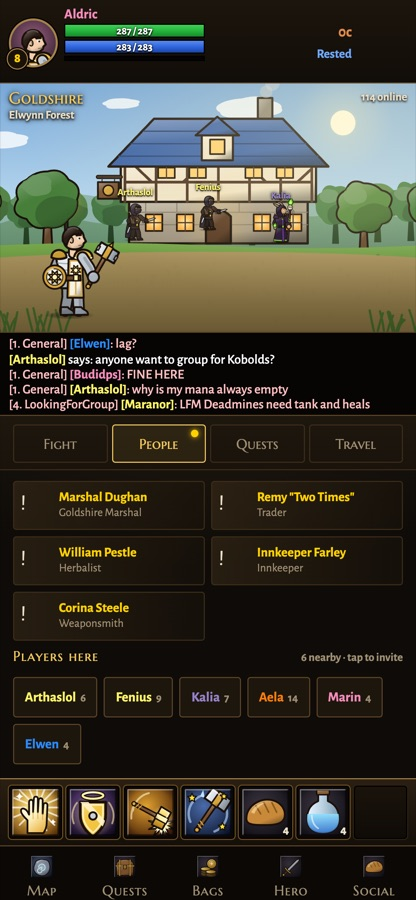
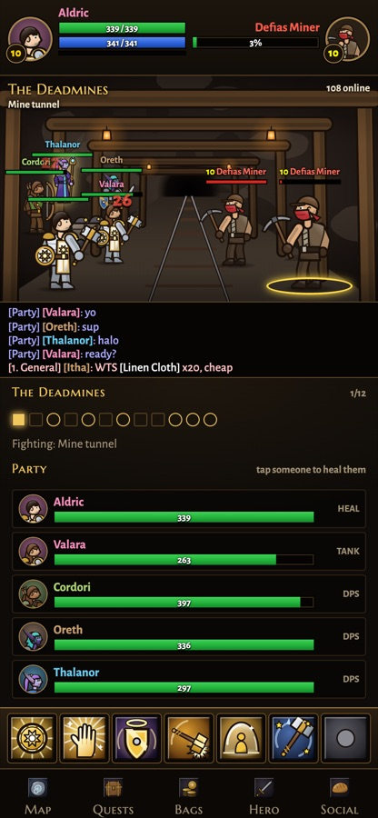
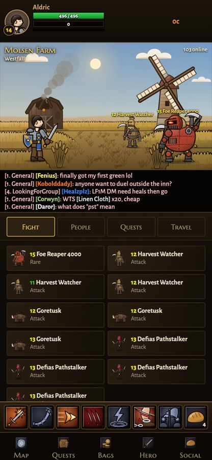
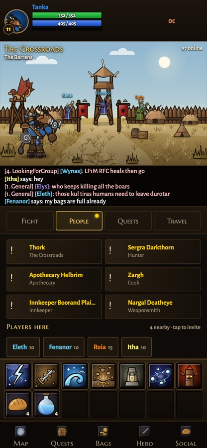
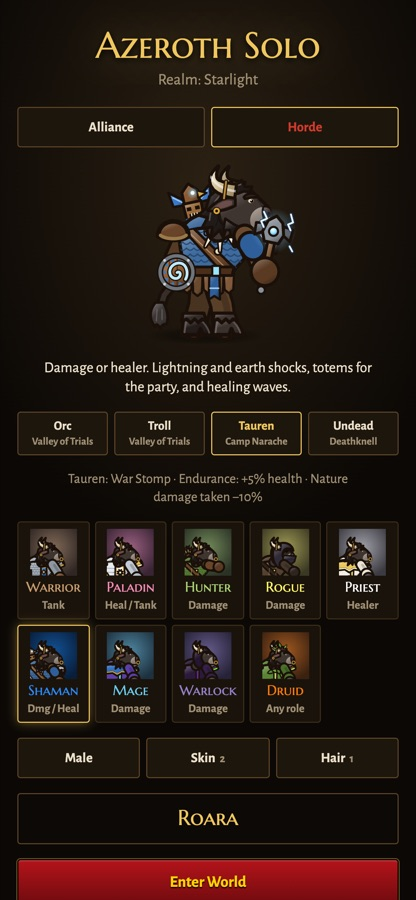
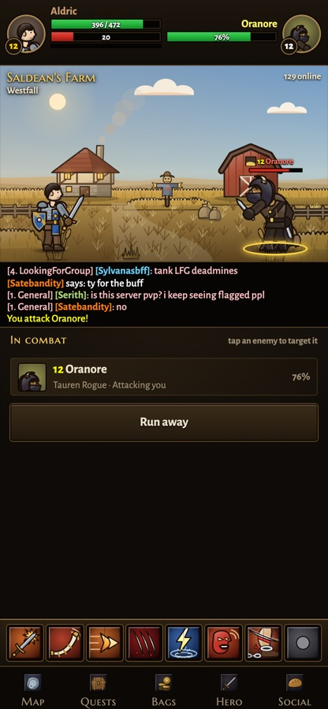
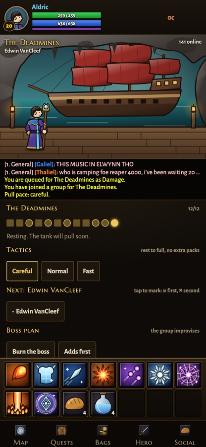
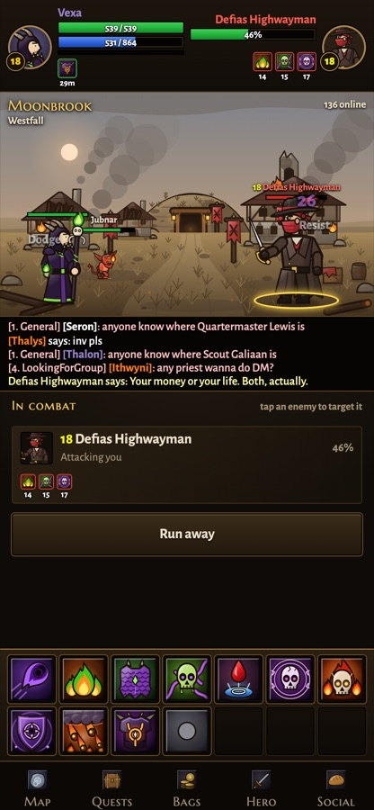

# Azeroth Solo

A single-player "MMO" for Android, set in the world of classic Warcraft. Every other player on the realm is simulated: they level, chat, form groups, run dungeons, win and lose loot rolls, and join your party in the open world. You get the feel of a busy server in a game you can put down at any time.

It is a numbers-and-visuals game, not a text adventure: hand-drawn scenes and sprites, real combat maths, gear, quests and dungeons.

<p align="center">
  
  
  
  
</p>
<p align="center">
  
  
  
  
</p>

> **Unofficial, non-commercial fan project.** Not affiliated with, endorsed by or sponsored by Blizzard Entertainment. World of Warcraft, Warcraft and Azeroth are trademarks or registered trademarks of Blizzard Entertainment, Inc. No Blizzard assets are used: all art (hand-written SVG), music (composed synth) and code in this repository are original. The game is free and will stay free.

## What's in it (v9)

- **Both factions, all 8 classic races.** Human, Dwarf, Gnome, Night Elf, Orc, Troll, Tauren, Undead, each with its own starting zone, and racial traits (one active, two passive).
- **Talents** from level 10: three trees per class.
- **Mounts** at 40: learn riding and buy your race's mount; every road is 40% faster.
- **Professions.** Mining, Herbalism, Skinning, Blacksmithing, Alchemy, Leatherworking and Tailoring: gather in the wild, craft gear, potions, elixirs and bags, and trade on the auction house.
- **Cities.** A bank and auction house in every capital, Stormwind included; daily bounty boards, Help Wanted, Mentor Marks, heirlooms and titles.
- **9 classes, any race can be any class.** Warrior, Paladin, Hunter, Rogue, Priest, Shaman, Mage, Warlock, Druid. Pets for Hunters and Warlocks, Bear Form for Druids, seals for Paladins, totems for Shamans.
- **Levels 1–60.** Starting zones, then Westfall and the Barrens, Redridge and Stonetalon, then Duskwood, the Wetlands and Hillsbrad, and contested Ashenvale, Stranglethorn Vale, the Arathi Highlands, Feralas, the Burning Steppes, the Western Plaguelands, Tanaris, Un'Goro Crater and Winterspring (neutral Gadgetzan, Marshal's Refuge and Everlook), with about 700 quests, named rares and unique drops.
- **Dungeons and elites with a group of simulated players.** Ragefire Chasm, The Deadmines, Wailing Caverns, The Stockade, Shadowfang Keep, Blackfathom Deeps, Gnomeregan, Razorfen Kraul, the Scarlet Monastery (Library and Cathedral), Zul'Farrak, Maraudon, Blackrock Depths, Scholomance, Stratholme, and open-world elites such as Hogger, Bellygrub, XT:9, Stitches, Big Samras, Sharptalon, the Razormaw Matriarch, King Bangalash, Kregg Keelhaul, Lord Shalzaru, King Mosh, Volchan, Araj the Summoner and Rak'shiri, with roles, threat, wipes and need/greed rolls. Groups are synced to the dungeon's level; you choose the pull pace, mark the kill order and pick a boss plan.
- **World PvP (War Mode).** Enemy players show up nearby; some pass by, some attack, and you can strike first. Guards help in towns. Ashenvale is contested: both factions quest there, each from its own town, and enemy players are more common. +10% XP and gold, and Honor.
- **A living server.** Players online by time of day, general and LFG chat, guilds, a welcome-back digest of what happened while you were away.
- **Our own expansion, "The Drowned Crown" (level 60).** After Chapter 6 an island rises from the sea: the Tidewatch Coast (Alliance) and the Skullreef Isles (Horde), a dungeon for each side (the Sunken Archive and the Temple of Shal'zua), and a 10-player raid for both, the Tidecrown Citadel, with its own story. All original.
- **Story cutscenes** at key levels and a first-time lore intro for every dungeon, replayable in the Theater.
- **Optional on-device AI chat** (Android): a small local model can write bot chat and banter ahead of time. Off by default; the game never lets it decide anything.

The plan up to level 60 and beyond is in [docs/plans/2026-09-27-roadmap-design.md](docs/plans/2026-09-27-roadmap-design.md).

## Install (Android)

Download the latest APK from [Releases](../../releases) and open it on your phone (you may need to allow installs from your browser or file manager). arm64 phones only.

## Build it yourself

The game is plain browser JavaScript in `src/`, bundled into one offline HTML file and wrapped in a small Flutter WebView app.

```bash
python3 build.py                      # bundle src/ into dist/index.html and app/assets/game/
cd app && flutter build apk --release --target-platform android-arm64
```

Needs Python 3, Flutter, and JDK 17. You can also open `dist/index.html` in a desktop browser to play without Android.

- `src/data/`: game data. `core.js` holds classes, abilities and shared items; `zones/<zone>.js` holds each zone's places, mobs, people and quests. `node tools/validate.js` checks every reference (the build runs it too)
- `src/engine.js`: combat (DOM-free, also runs in Node)
- `src/bots.js`: the simulated server
- `src/game.js`, `src/ui.js`: game logic and interface
- `src/art*.js`: all art as SVG
- `sim/`: balance and flow simulations (`node sim/v20.js`)
